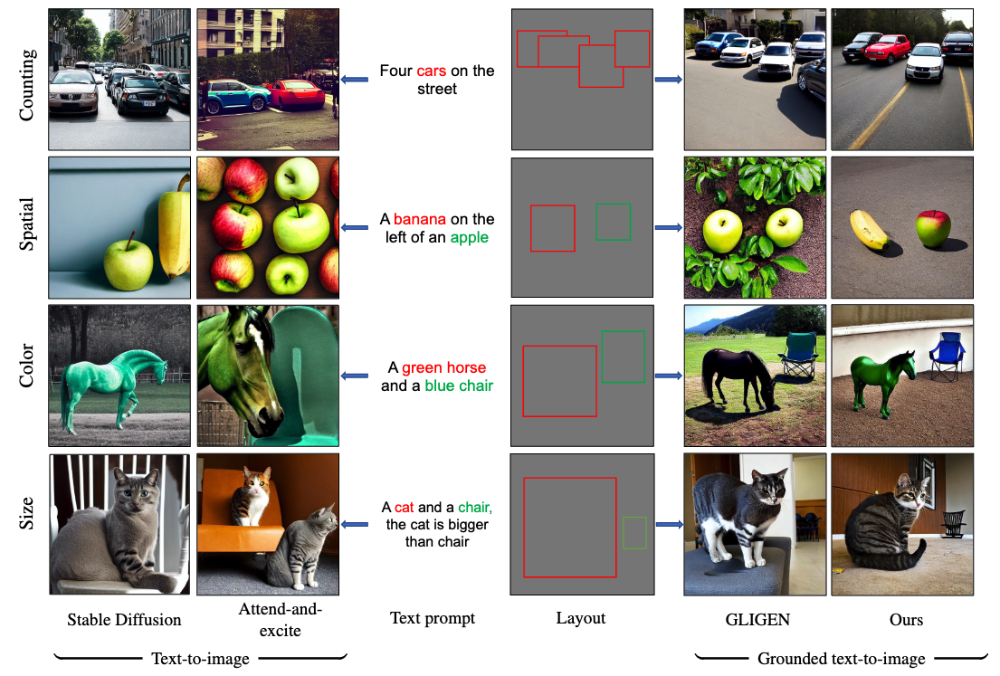

# Attention Refocusing

[[Website](https://attention-refocusing.github.io)][[Demo](https://huggingface.co/spaces/attention-refocusing/Attention-refocusing)]

This is the official implementation of the paper "Grounded Text-to-Image Synthesis with Attention Refocusing"


https://github.com/Attention-Refocusing/attention-refocusing/assets/135548632/23195e0c-b7f9-4abb-8903-f3601a5a2590


## Setup
```bash
conda create --name ldm_layout python==3.8.0
conda activate ldm_layout
conda install pytorch torchvision torchaudio pytorch-cuda=11.7 -c pytorch -c nvidia
pip install -r requirements.txt
pip install git+https://github.com/CompVis/taming-transformers.git
pip install git+https://github.com/openai/CLIP.git
```
## Inference 



Download the model [GLIGEN](https://huggingface.co/gligen/gligen-generation-text-box/blob/main/diffusion_pytorch_model.bin) and put them in `gligen_checkpoints`


Run with the prompts in HRS/Drawbench prompts :
```
python guide_gligen.py --ckpt [model_checkpoint]  --file_save [save_path] \
                       --type [category] --box_pickle [saved_boxes] --use_gpt4
```
Where

<!-- ```--ckpt``` : path to checkpoint of GLIGEN
save_path: the folder ot save images
category: the categories: counting, spatial, color, size
saved_boxes: the path to the generated layout from chatGPT
--use_gpt4: whether using GPT4 to generate layout.
If use GPT4, set your gpt4 api key
export OPENAI_API_KEY='your-api-key' -->

- `--ckpt`: Path to the GLIGEN checkpoint
- `--file_save`: Path to save the generated images
- `--type`: The category to test (options include counting, spatial, color, size)
- `--box_pickle`: Path to save the generated layout from GPT-4
- `--use_gpt4`: Whether to use GPT-4 to generate the layout. If you're using GPT-4, set your GPT-4 API key as follows:
```bash
export OPENAI_API_KEY='your-api-key'
```
For instance, to generate images according to the layouts and prompts of the counting category:
```bash
python guide_gligen.py --ckpt gligen_checkpoints/diffusion_pytorch_model.bin --file_save counting_500 \
                       --type counting --box_pickle ../data_evaluate_LLM/gpt_generated_box/counting.p
```
To run with user input text prompts:
```bash
export OPENAI_API_KEY='your-api-key'
python inference.py --ckpt gligen_checkpoints/diffusion_pytorch_model.bin
```
We provide generated layout from GPT4 for HRS benchmark in the  [HRS boxes](data_evaluate_LLM/gpt_generated_box), [DrawBench boxes](data_evaluate_LLM/gpt_generated_box_drawbench)  
We also provide generated images from GLIGEN, and other baselines including Stable Diffusion, Attend-and-excite, MultiDiffusion, Layout-guidance, GLIGEN and ours [here](https://drive.google.com/drive/folders/1t9LNoVppVsJG9B2LcvXF-4GMVXucbvlS?usp=sharing)

## Evaluation
Set up the environment, download detector models, and run evaluation for each category, see the [evaluation](data_evaluate_LLM/eval_metrics/README.md).

## Acknowledgments

This project is built on the following resources:

- [**GLIGEN**](https://github.com/gligen/GLIGEN): Our code is built upon the foundational work provided by GLIGEN. 

- [**HRS**](https://github.com/eslambakr/HRS_benchmark): The evaluation component of our project has been adopted from HRS. 